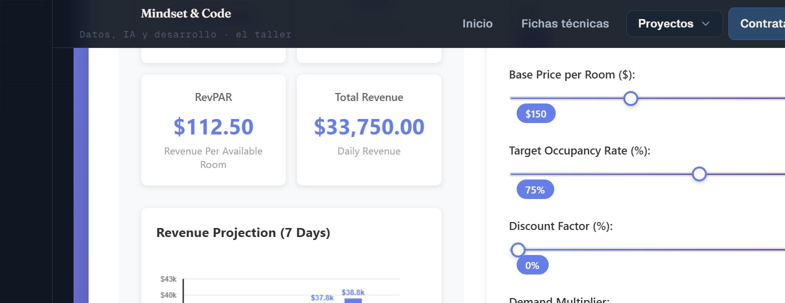

# Revenue Management Dashboard & Pricing Simulator

> **Front-end portfolio project** · Vanilla JS · RevOps · Interactive simulator
> **Status:** Finished
> An interactive, dependency-free web app that lets you tune room count, base price, occupancy and demand, and watch projected revenue recalculate live — Revenue Management made tangible in the browser.

> 🇬🇧 **English version first.** · 🇪🇸 **La versión en español está más abajo** → [ir a Español](#-español).

[](https://mindset-code.com/codigo)
[](.)
[](.)
[](LICENSE)

[](https://proyectos-mindset-code.web.app/revenue)

*[Open the live demo](https://proyectos-mindset-code.web.app/revenue)*

---

## The problem this solves

Pricing decisions are abstract until you can *see* them. This simulator turns the levers of Revenue Management — inventory, base price, occupancy, discount and demand — into sliders, and recalculates projected revenue in real time with a live chart. It makes the trade-offs of a pricing strategy intuitive for a non-technical audience.

It also demonstrates clean **front-end engineering with zero frameworks**: structured vanilla JavaScript, event-driven state, and a charting layer — proof that solid UX doesn't require a heavy stack.

---

## Key features

- **Live recalculation** — every input updates projected revenue instantly.
- **Interactive revenue chart** — visual projection that responds to the inputs.
- **No build, no dependencies** — open `index.html` and it runs.
- **Tunable levers** — room count, base price, occupancy rate, discount factor and demand multiplier.

---

## Tech stack

| Layer | Technology |
|-------|-----------|
| Markup | HTML5 |
| Styling | CSS3 |
| Logic | Vanilla JavaScript (event-driven) |
| Charting | Chart.js |

---

## Getting started

```bash
git clone https://github.com/mindset-code/project-revenue-management-web.git
cd project-revenue-management-web

# No build step — just open the file in a browser:
xdg-open index.html      # or double-click it
```

---

## Repository structure

```
project-revenue-management-web/
├── index.html    # layout + controls
├── script.js     # revenue logic + chart + event handling
├── styles.css    # styling
├── LICENSE       # MIT
└── README.md
```

---

## License & contact

Released under the **[MIT License](LICENSE)**.

- **Portfolio:** [proyectos-mindset-code.web.app](https://proyectos-mindset-code.web.app)
- **Web:** [mindset-code.com](https://mindset-code.com)
- **Email:** contacto@mindset-code.com

---

# 🇪🇸 Español

# Revenue Management Dashboard & Pricing Simulator

> **Proyecto de portafolio de Front-end** · Vanilla JS · RevOps · Simulador interactivo
> **Estado:** Terminado
> Una app web interactiva y sin dependencias que permite ajustar número de habitaciones, precio base, ocupación y demanda, y ver recalcularse el ingreso proyectado en vivo — el Revenue Management hecho tangible en el navegador.

> 🇪🇸 Traducción al español. La versión en inglés está al inicio → [ir a English](#revenue-management-dashboard--pricing-simulator).

---

## El problema que resuelve

Las decisiones de pricing son abstractas hasta que puedes *verlas*. Este simulador convierte las palancas del Revenue Management —inventario, precio base, ocupación, descuento y demanda— en sliders, y recalcula el ingreso proyectado en tiempo real con un gráfico en vivo. Hace intuitivos los trade-offs de una estrategia de precios para una audiencia no técnica.

También demuestra **ingeniería front-end limpia sin frameworks**: JavaScript vanilla estructurado, estado dirigido por eventos y una capa de gráficos — prueba de que una buena UX no exige un stack pesado.

---

## Características clave

- **Recálculo en vivo** — cada input actualiza el ingreso proyectado al instante.
- **Gráfico de ingresos interactivo** — proyección visual que responde a los inputs.
- **Sin build ni dependencias** — abre `index.html` y funciona.
- **Palancas ajustables** — nº de habitaciones, precio base, tasa de ocupación, factor de descuento y multiplicador de demanda.

---

## Stack técnico

| Capa | Tecnología |
|------|-----------|
| Marcado | HTML5 |
| Estilos | CSS3 |
| Lógica | JavaScript vanilla (dirigido por eventos) |
| Gráficos | Chart.js |

---

## Cómo empezar

```bash
git clone https://github.com/mindset-code/project-revenue-management-web.git
cd project-revenue-management-web

# Sin paso de build — solo abre el archivo en el navegador:
xdg-open index.html      # o haz doble clic
```

---

## Estructura del repositorio

```
project-revenue-management-web/
├── index.html    # layout + controles
├── script.js     # lógica de ingresos + gráfico + manejo de eventos
├── styles.css    # estilos
├── LICENSE       # MIT
└── README.md
```

---

## Licencia y contacto

Publicado bajo la **[Licencia MIT](LICENSE)**.

- **Portafolio:** [proyectos-mindset-code.web.app](https://proyectos-mindset-code.web.app)
- **Web:** [mindset-code.com](https://mindset-code.com)
- **Email:** contacto@mindset-code.com

---

*Mindset & Code · asesoría fiscal y tecnológica · [mindset-code.com](https://mindset-code.com)*
